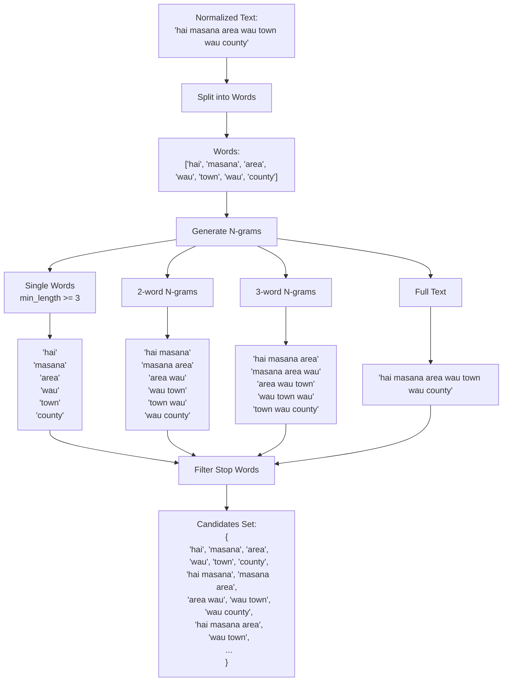

# Geocoding Process: Detailed Flow Diagrams

## Overview

This document provides detailed diagrams and explanations of the geocoding process for the address: **"Hai Masana area, Wau Town, Wau County"**.

---

## 1. High-Level Architecture


---

## 2. Main Geocoding Flow


---

## 3. Text Normalization Process


### Normalization Details

| Step | Input | Output | Description |
|------|-------|--------|-------------|
| 1. Unicode | `Hai Masana` | `Hai Masana` | Remove diacritics |
| 2. Lowercase | `Hai Masana` | `hai masana` | Convert to lowercase |
| 3. Abbreviations | `c equatoria` | `central equatoria` | Expand abbreviations |
| 4. Transliterations | `waw` | `wau` | Normalize spellings |
| 5. Remove Punctuation | `area, Wau` | `area wau` | Remove commas, periods |
| 6. Collapse Whitespace | `area  wau` | `area wau` | Single spaces |

---

## 4. Hierarchical Constraint Parsing


### Constraint Parsing Logic

```python
# Pseudo-code for parse_hierarchical_constraints()

parts = ["Hai Masana area", "Wau Town", "Wau County"]
constraints = {
    "state": None,
    "county": None,
    "payam": None,
    "boma": None,
    "village": None
}

for part in parts:
    normalized = normalize_text(part)
    
    if "county" in normalized:
        constraints["county"] = "wau"  # Remove "county" keyword
    
    if "town" in normalized:
        constraints["village"] = "wau"  # Remove "town" keyword
    
    if no_keywords and is_first_part:
        constraints["village"] = "hai masana area"

# Final constraints:
# {
#   "village": "hai masana area",  # From first part
#   "county": "wau",                # From "Wau County"
#   "state": None,
#   "payam": None,
#   "boma": None
# }
```

---

## 5. Candidate Extraction Process



### N-gram Generation Example

| Type | Examples | Count |
|------|----------|-------|
| 1-gram | `hai`, `masana`, `area`, `wau`, `town`, `county` | 6 |
| 2-gram | `hai masana`, `masana area`, `area wau`, `wau town`, `wau county` | 5 |
| 3-gram | `hai masana area`, `masana area wau`, `area wau town`, `wau town wau` | 4 |
| 4-gram | `hai masana area wau`, `masana area wau town` | 2 |
| Full | `hai masana area wau town wau county` | 1 |

**After filtering stop words** (`the`, `of`, `in`, `at`, `on`, `to`, `for`, `and`, `or`, `a`, `an`):
- `area` might be kept (could be part of place name)
- `town` might be kept (could be part of place name)

---

## 6. Hierarchical Resolution Decision Tree


---

## 7. Village Search Process (Detailed)


### Village Search SQL Query Example

```sql
-- Primary query with constraints
SELECT village_id, name, normalized_name, lon, lat,
       state, county, payam, boma, data_source, verified
FROM villages
WHERE LOWER(county) LIKE LOWER('%wau%')
-- Returns only villages in Wau County

-- If no results, fallback to exact match
SELECT village_id, name, normalized_name, lon, lat,
       state, county, payam, boma, data_source, verified
FROM villages
WHERE LOWER(county) = LOWER('wau')

-- If still no results, try state only
SELECT village_id, name, normalized_name, lon, lat,
       state, county, payam, boma, data_source, verified
FROM villages
WHERE LOWER(state) LIKE LOWER('%western bahr el ghazal%')
```

---

## 8. Fuzzy Matching Process


### Fuzzy Matching Algorithms

| Algorithm | Description | Use Case |
|-----------|-------------|----------|
| `token_sort_ratio` | Sorts tokens, then compares | "masana hai" vs "hai masana" |
| `partial_ratio` | Best substring match | "masana" in "hai masana area" |
| `WRatio` | Weighted combination | Overall best match |

### Scoring Example

```
Query: "hai masana"
Choice: "Hai Masana area"

1. Normalize both: "hai masana" vs "hai masana area"
2. token_sort_ratio: 85% (good match, order doesn't matter)
3. partial_ratio: 100% (query is substring of choice)
4. Length check: query_len=11, choice_len=18
   - ratio = 11/18 = 0.61 (acceptable, >0.6)
5. Final score: 0.85-0.95 (substring match with boost)
```

---

## 9. Context Boost Application


### Context Boost Example

```
Base Match:
  - Query: "hai masana"
  - Village: "Hai Masana"
  - County: "Wau County"
  - Base Score: 0.85

Constraints:
  - county: "wau"

Boost Calculation:
  - Base score: 0.85
  - County matches: +0.20
  - Layer (village): +0.15
  - Final score: 0.85 + 0.20 + 0.15 = 1.20 → clamped to 1.0

If county was wrong (e.g., "Juba County"):
  - Base score: 0.85
  - County wrong: -0.30
  - Final score: 0.85 - 0.30 = 0.55 (below threshold, rejected)
```

---

## 10. Complete Example: "Hai Masana area, Wau Town, Wau County"

### Step-by-Step Execution


### Detailed Execution Trace

#### Step 1: Input Processing
```
Input: "Hai Masana area, Wau Town, Wau County"
↓
Normalized: "hai masana area wau town wau county"
```

#### Step 2: Constraint Parsing
```
Parts: ["Hai Masana area", "Wau Town", "Wau County"]
↓
Constraints:
  - village: "hai masana area" (from first part)
  - county: "wau" (from "Wau County")
  - state: None
  - payam: None
  - boma: None
```

#### Step 3: Candidate Extraction
```
Candidates: {
  "hai", "masana", "area", "wau", "town", "county",
  "hai masana", "masana area", "area wau", "wau town", "wau county",
  "hai masana area", "masana area wau", "area wau town", "wau town wau",
  ...
}
```

#### Step 4: Village Search
```sql
-- Query executed in DuckDB
SELECT village_id, name, normalized_name, lon, lat,
       state, county, payam, boma
FROM villages
WHERE LOWER(county) LIKE LOWER('%wau%')
-- Returns: [village1, village2, village3, ...]
```

#### Step 5: Fuzzy Matching
```
Query: "hai masana area"
Candidates from DB: ["Hai Masana", "Hai Masana area", "Wau Town", ...]

Matching Process:
1. Exact match: "hai masana area" == "hai masana area" → score=1.0 ✓
2. If not found, substring: "hai masana" in "hai masana area" → score=0.90
3. If not found, fuzzy: token_sort_ratio("hai masana area", "hai masana") → score=0.85
```

#### Step 6: Context Boost
```
Base match: "Hai Masana area"
  - Base score: 0.90
  - County constraint: "wau"
  - Village county: "Wau County" ✓
  - Boost: +0.20 (county matches)
  - Layer boost: +0.15 (village)
  - Final score: 1.0 (clamped)
```

#### Step 7: Constraint Validation
```
Matched village:
  - name: "Hai Masana area"
  - county: "Wau County"
  - state: "Western Bahr el Ghazal"

Constraints:
  - county: "wau"

Validation:
  - "wau" in "Wau County" → ✓ PASS
  - Return village result
```

#### Step 8: Result Construction
```python
GeocodeResult(
    input_text="Hai Masana area, Wau Town, Wau County",
    normalized_text="hai masana area wau town wau county",
    resolved_layer="villages",
    feature_id="abc123...",
    matched_name="Hai Masana area",
    score=1.0,
    lon=28.123456,
    lat=7.654321,
    state="Western Bahr el Ghazal",
    county="Wau County",
    payam="Wau Payam",
    boma="Hai Masana Boma",
    village="Hai Masana area",
    alternatives=[...]
)
```

---

## 11. Data Flow Diagram


---

## 12. Error Handling and Edge Cases


---

## 13. Performance Considerations

### Caching Strategy


### Database Query Optimization

| Query Type | Index Used | Performance |
|------------|------------|-------------|
| Village search by county | `idx_villages_county` | Fast (indexed) |
| Village search by name | `idx_villages_name` | Fast (indexed) |
| Name index search | `idx_name_index_normalized` | Fast (indexed) |
| Spatial hierarchy lookup | Spatial index (GeoPandas) | Medium (in-memory) |

---

## 14. Summary

### Key Points

1. **Text Normalization**: Converts input to searchable format
2. **Constraint Parsing**: Extracts hierarchical information (state, county, etc.)
3. **Candidate Extraction**: Generates n-grams for matching
4. **Hierarchical Resolution**: Tries village → boma → payam → county
5. **Fuzzy Matching**: Uses progressive matching (exact → substring → fuzzy)
6. **Context Boost**: Increases scores for matches that align with constraints
7. **Constraint Validation**: Ensures results match specified boundaries
8. **Caching**: Speeds up repeated queries

### For "Hai Masana area, Wau Town, Wau County"

1. ✅ Identifies "Wau County" as constraint
2. ✅ Searches villages in Wau County only
3. ✅ Matches "Hai Masana area" or "Hai Masana"
4. ✅ Validates county constraint
5. ✅ Returns village coordinates with full hierarchy

---

## Appendix: Code References

### Key Functions

- `Geocoder.geocode()` - Main entry point
- `normalize_text()` - Text normalization
- `parse_hierarchical_constraints()` - Constraint extraction
- `extract_candidates()` - N-gram generation
- `_try_settlement_match()` - Village search
- `search_villages()` - Database village search
- `progressive_fuzzy_match()` - Fuzzy matching
- `apply_context_boost()` - Score boosting
- `_try_polygon_match()` - Polygon layer search

### Configuration

- `FUZZY_THRESHOLD = 0.7` - Minimum match score
- `LAYER_NAMES` - Admin layer names
- `CENTROID_CRS = "EPSG:32736"` - UTM Zone 36N for South Sudan


